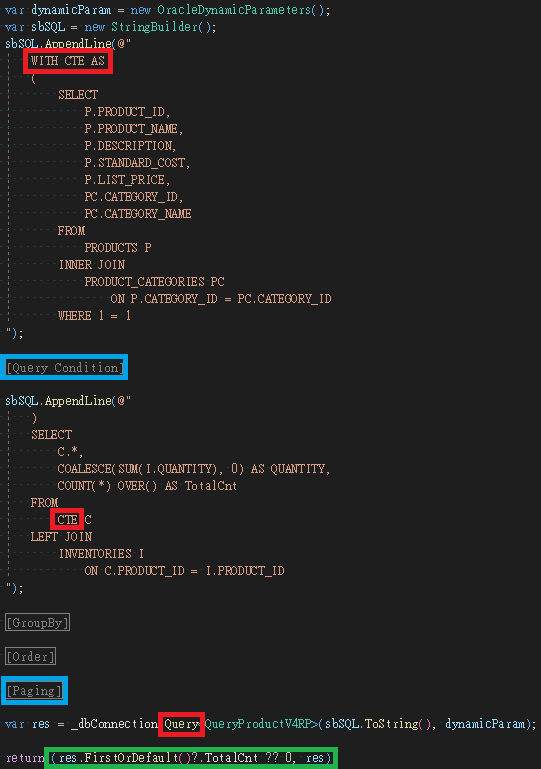
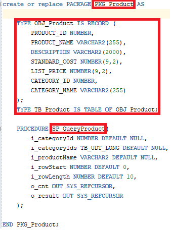

# Dapper整合Oracle範例
- [Dapper整合Oracle範例](#dapper整合oracle範例)
- [環境設定](#環境設定)
- [DB初始化設定](#db初始化設定)
- [專案架構介紹](#專案架構介紹)
- [CRUD範例](#crud範例)
- [參考資料](#參考資料)

<div style="page-break-after:always;"></div>

# 環境設定
- Docker Desktop
  - 開啟 Hyper-V
    <br>
    
  
  - 安装 WSL2
    ```
    wsl --install
    ```
  
  - 安裝 Docker Desktop
    <br>
    官方載點 https://www.docker.com/products/docker-desktop/
    <br>
    說明文件 https://docs.docker.com/desktop/install/windows-install/
  
  - 測試 Docker Desktop
    ```
    docker run hello-world
    ```
    <br>
    

- Oracle
  - 下載 Docker Image
    ```
    docker pull container-registry.oracle.com/database/express:latest
    ```
    <br>
    
  
  - 建立 & 啟動 Container
    <br>
    [container-name] : Container名稱
    <br>
    [custom-pwd] : 預設使用者密碼
    ```
    docker container create -it --name [container-name] -p 1521:1521 -e ORACLE_PWD=[custom-pwd] container-registry.oracle.com/database/express:latest
    ```
    <br>
    

<div style="page-break-after:always;"></div>

  - SQL Developer 連線設定
    <br>
    使用者名稱 : system
    <br>
    密碼 : [custom-pwd]
    <br>
    

<div style="page-break-after:always;"></div>

# DB初始化設定
- SQL Script
  - InitialScript
    <br>
    ot_create_user.pls : 建立使用者/權限
    <br>
    ot_schema.pls : 建立測試資料表
    <br>
    ot_data.pls : 建立測試資料

  - Type
    <br>
    UDT_XXXXXX.pls : User-Defined Type
    <br>
    OBJ_XXXXXX.pls : Type As Object
    <br>
    TB_XXXXXX.pls : Type As Table Of Object

  - StoredProcedure
    <br>
    SP_XXXXXX.pls : Procedure

  - Package
    <br>
    PKG_XXXXXX.pls : Package

  

- SQL Developer 連線設定
  <br>
  使用者名稱 : OT
  <br>
  密碼 : Orcl1234
  <br>
  

<div style="page-break-after:always;"></div>

- 初始資料預覽
  <br>
  

<div style="page-break-after:always;"></div>

# 專案架構介紹
- 概述
  <br>
  Controllers : API接口
  <br>
  Servies : 流程控制
  <br>
  Repositories : 資料庫操作
  <br>
  Models : API介接物件/資料庫物件
  <br>
  Utility : 共用元件
  <br>
  

<div style="page-break-after:always;"></div>

- 參考
  <br>
  Dapper : Micro-ORM
  <br>
  Oracle.ManagedDataAccess.Core : Oracle DB 資料驅動
  <br>
  Swashbuckle.AspNetCore : Swagger
  <br>
  

- 設定
  - appsettings.json
    <br>
    DBConnectionStrings : DB 連線字串
    <br>
    DbType : Repository實作類別 (RAW or SP)
    <br>
    

  - Program.cs
    <br>
    DI 註冊 : DB連線/Repository/Service
    <br>
    Dapper 自定義欄位對應 : DB Table Column & Project Model
    <br>
    

  - launchSettings.json
    <br>
    本機IISExpress啟動網址 : https://localhost:44343
    <br>
    

- Swagger : https://localhost:44343/swagger
  <br>
  

<div style="page-break-after:always;"></div>

# CRUD範例
- 單筆查詢
  - RAW
    <br>
    SQL字串中變數使用前綴 : 符號對應傳入參數名稱
    <br>
    

  - SP
    <br>
    程式呼叫端 :
    <br>
    傳入 Input / Output 參數
    <br>
    
    <br>
    <br>
    SP執行端 :
    <br>
    使用 OPEN Cursor FOR 將查詢結果賦予 Out Cursor 回傳
    <br>
    

<div style="page-break-after:always;"></div>

- 多筆查詢 (Query Twice)
  - RAW
    <br>
    因 Oracle 無法識別多個查詢語句，故須使用 Cursor 才能接收多個回傳集合
    <br>
    使用多個 OPEN Cursor FOR 將不同查詢結果分別賦予 Out Cursor 回傳
    <br>
    

  - SP
    <br>
    程式呼叫端 :
    <br>
    傳入 Input / Output 參數
    <br>
    
    <br>
    <br>
    SP執行端 :
    <br>
    使用多個 OPEN Cursor FOR 將不同查詢結果分別賦予 Out Cursor 回傳
    <br>
    INSTR函式執行 WHERE IN 效果
    <br>
    OFFSET [n] ROWS FETCH NEXT [m] ROWS ONLY 執行分頁效果
    <br>
    

<div style="page-break-after:always;"></div>

- 多筆查詢 (Collection)
  <br>
  預先建立 Type 物件
  <br>
  
  - RAW
    <br>
    定義 Type 變數，將共用邏輯查詢結果存放在此變數中
    <br>
    從 Type 變數中執行不同的查詢，再分別賦予 Out Cursor 回傳
    <br>
    

  - SP
    <br>
    程式呼叫端 :
    <br>
    傳入 Input / Output 參數
    <br>
    
    <br>
    <br>
    SP執行端 :
    <br>
    定義 Type 變數，將共用邏輯查詢結果存放在此變數中
    <br>
    從 Type 變數中執行不同的查詢，再分別賦予 Out Cursor 回傳
    <br>
    

<div style="page-break-after:always;"></div>

- 多筆查詢 (Count Over)
  - RAW
    <br>
    使用 Count Over 函式輔助，合併查詢
    <br>
    

  - SP
    <br>
    程式呼叫端 :
    <br>
    傳入 Input / Output 參數
    <br>
    
    <br>
    <br>
    SP執行端 :
    <br>
    使用 Count Over 函式輔助，合併查詢
    <br>
    

<div style="page-break-after:always;"></div>

- 多筆查詢 (With As)
  - RAW
    <br>
    使用 With As 將共用邏輯查詢結果暫存，後續再執行實務需求
    <br>
    

  - SP
    <br>
    程式呼叫端 :
    <br>
    傳入 Input / Output 參數
    <br>
    
    <br>
    <br>
    SP執行端 :
    <br>
    使用 With As 將共用邏輯查詢結果暫存，後續再執行實務需求
    <br>
    

<div style="page-break-after:always;"></div>

- 多筆查詢 (UDT)
  - RAW
    <br>
    使用 UDT 傳入物件執行 WHERE IN 效果
    <br>
    

  - SP
    <br>
    程式呼叫端 :
    <br>
    傳入 UDT 物件
    <br>
    
    <br>
    SP執行端 :
    <br>
    使用 UDT 物件執行 WHERE IN 效果
    <br>
    

<div style="page-break-after:always;"></div>

- 多筆查詢 (Package)
  - SP
    <br>
    程式呼叫端 :
    <br>
    呼叫 Package 內的 StoredProcedure
    <br>
    
    <br>
    SP執行端 :
    <br>
    使用 Package 內定義 Type 變數，將共用邏輯查詢結果存放在此變數中
    <br>
    
    
  
<div style="page-break-after:always;"></div>

- 新增
  - RAW
    <br>
    使用 Out 變數接收 Identity 自動產生的 PKey
    <br>
    

  - SP
    <br>
    程式呼叫端 :
    <br>
    傳入 Input / Output 參數
    <br>
    
    <br>
    <br>
    SP執行端 :
    <br>
    使用 Out 變數接收 Identity 自動產生的 PKey
    <br>
    

<div style="page-break-after:always;"></div>

- 修改
  - RAW
    <br>
    

  - SP
    <br>
    程式呼叫端 :
    <br>
    傳入 Input 參數
    <br>
    
    <br>
    <br>
    SP執行端 :
    <br>
    

<div style="page-break-after:always;"></div>

- 刪除
  - RAW
    <br>
    

  - SP
    <br>
    程式呼叫端 :
    <br>
    傳入 Input 參數
    <br>
    
    <br>
    <br>
    SP執行端 :
    <br>
    INSTR函式執行 WHERE IN 效果
    <br>
    

<div style="page-break-after:always;"></div>

- 新增 (Transaction)
  - RAW
    <br>
    使用 BeginTransaction 將兩段執行語句包在一起，確保交易一致性
    <br>
    

  - SP
    <br>
    程式呼叫端 :
    <br>
    
    <br>
    <br>
    SP執行端 :
    <br>
    使用 Begin Exception 區塊執行，確保交易一致性
    <br>
    

<div style="page-break-after:always;"></div>

- 新增 (TransactionScope)
  <br>
  使用 TransactionScope 將兩段執行語句包在一起，確保交易一致性
  <br>
  

<div style="page-break-after:always;"></div>

# 參考資料
- Docker Desktop 安裝
  <br>
  https://www.runoob.com/docker/windows-docker-install.html

- Oracle 安裝/建立使用者
  <br>
  https://medium.com/geekculture/run-oracle-database-21c-in-docker-351049344d0c
  <br>
  https://hackmd.io/@CloudyWing/SJsMfcGMo

- Oracle 測試資料庫
  <br>
  https://www.w3cschool.cn/oraclejc/oraclejc-gpa52qqy.html

- Oracle.ManagedDataAccess
  <br>
  https://blog.yowko.com/dapper-oracle-manageddataaccess/
  <br>
  https://www.c-sharpcorner.com/article/net-core-with-oracle-database-using-dapper/

- OracleDynamicParameter
  <br>
  https://blog.darkthread.net/blog/dapper-ref-cursor/
  <br>
  https://gist.github.com/vijayganeshpk/3096151

- Dapper Column Mapping
  <br>
  https://dotblogs.com.tw/supershowwei/2016/08/16/175753

- Dapper ColumnAttributeTypeMapper
  <br>
  https://stackoverflow.com/questions/20951531/dapper-with-attributes-mapping/20969521#20969521
  <br>
  https://gist.github.com/kalebpederson/5460509

- Dapper QueryMultiple
  <br>
  https://www.cnblogs.com/51net/p/16069796.html
  <br>
  https://www.cnblogs.com/51net/p/16069684.html

- Dapper Transaction / TransactionScope
  <br>
  https://stackoverflow.com/questions/44118876/which-transaction-is-better-with-dapper-begin-tran-or-transactionscope
  <br>
  https://stackoverflow.com/questions/6860979/dapper-transactionscope
  <br>
  https://kevintsengtw.blogspot.com/2015/09/dapper_28.html

- Oracle Cursor
  <br>
  https://godleon.blogspot.com/2008/12/oracle-cursor-cursor-variable.html

- Oracle Stored Procedure
  <br>
  https://matthung0807.blogspot.com/2017/08/oracle-stored-procedures.html
  <br>
  https://medium.com/jimmy-wang/oracle%E5%9F%BA%E6%9C%AC%E4%BF%AE%E7%B7%B4-pl-sql-stored-procedures-and-functions-73b235631880

- Oracle Temporary Table / Collection
  <br>
  https://stackoverflow.com/questions/41689135/how-to-create-a-temporary-table-inside-stored-procedure-before-opening-a-cursor

- Oracle Temporary Table
  <br>
  https://blog.darkthread.net/blog/odpnet-temp-table/
  <br>
  https://www.cnblogs.com/kerrycode/p/3285936.html

- Oracle Collection
  <br>
  https://godleon.blogspot.com/2008/12/oracle-collection.html
  <br>
  https://godleon.blogspot.com/2008/12/oracle-record.html
  <br>
  https://www.cnblogs.com/liuning8023/archive/2012/05/10/2495019.html
  <br>
  https://blog.csdn.net/liangweiwei130/article/details/38223319

- Oracle Bulk Collect / ForAll
  <br>
  https://blog.51cto.com/u_15127540/3343414
  <br>
  https://www.itread01.com/articles/1478240721.html

- Oracle INSTR()
  <br>
  https://www.sjkjc.com/oracle-ref/instr/
  <br>
  https://tomkuo139.blogspot.com/2009/01/plsql-substring-string.html
  <br>
  https://www.cnblogs.com/qinyios/p/11207981.html

- Oracle Count Over
  <br>
  https://juejin.cn/s/oracle%20count%20over%20partition
  <br>
  https://blog.csdn.net/sinat_19671783/article/details/73925833

- Oracle With As
  <br>
  https://www.cnblogs.com/mingforyou/p/8295239.html
  <br>
  https://dljeng.blogspot.com/2018/01/oracle-with.html

- Oracle UDT
  <br>
  https://stackoverflow.com/questions/50694795/oracle-managed-driver-user-defined-types
  <br>
  https://medium.com/oracledevs/announcing-odp-net-21-3-user-defined-types-for-managed-odp-net-and-odp-net-core-836fa81da3ba
  <br>
  https://github.com/oracle/dotnet-db-samples/tree/master/samples/udt
  <br>
  https://www.codeproject.com/Articles/1261430/Calling-Oracles-Stored-Procedures-and-Mapping-User

- Oracle Package
  <br>
  https://matthung0807.blogspot.com/2017/09/oracle-package.html
  <br>
  https://www.cnblogs.com/xqzt/p/4875891.html
  <br>
  https://stackoverflow.com/questions/67622904/define-custom-type-in-package
  <br>
  https://stackoverflow.com/questions/15420642/pass-udt-defined-in-a-package-as-a-parameter-to-stored-proc-in-oracle

- Oracle Transaction
  <br>
  https://dba.stackexchange.com/questions/84769/commit-and-rollback-in-oracle-stored-procedure
  <br>
  https://blog.csdn.net/chenglaozong/article/details/85265337
